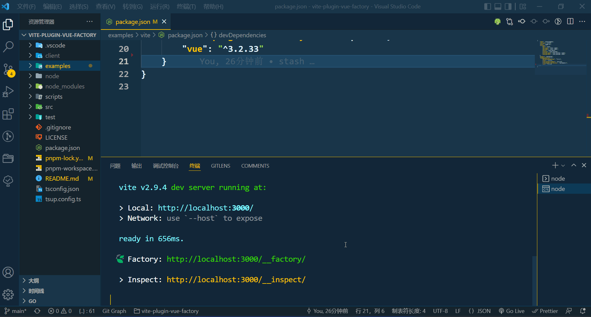

<div align="center">
    
    <h1>vite-plugin-vue-factory</h1>
    <p>vite 的 vue 可视化工程管理插件</p>
</div>

<br />
<br />

## 动机

希望用可视化的方式管理 `vite` 下的 `vue` 项目

<br />
<br />

## 特性

- 自动安装模块

<br />
<br />

## 使用

### 安装

```shell
npm i vite-plugin-vue-factory -D
```

TODO

<br />
<br />

## 组织 🦔

欢迎关注 **帝莎编程**

- [官网](http://dishaxy.dishait.cn/)
- [Gitee](https://gitee.com/dishait)
- [Github](https://github.com/dishait)
- [网易云课堂](https://study.163.com/provider/480000001892585/index.htm?share=2&shareId=480000001892585)

<br />
<br />

## License

Made with [markthree](https://github.com/markthree)

Published under [MIT License](./LICENSE).

<br />
